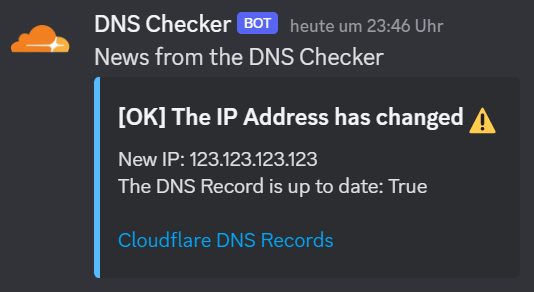

# Cloudflare DNS Checker

### TL;DR;

This python tool helps you to keep the A-Record of your DNS zone up to date. The only thing you have to do is to schedule this script with a cronjob or similar. Have fun! ;-)

## How it work's

1. Get the current WAN ip address
2. Login to the cloudflare api and get the ip address of the first a-record
3. Change it if it's necessary
4. send a discord message about the ip state (if it has changed or not)

## Open Tasks

- Implement several Null-Checks
- Add error msgs
- Logger
